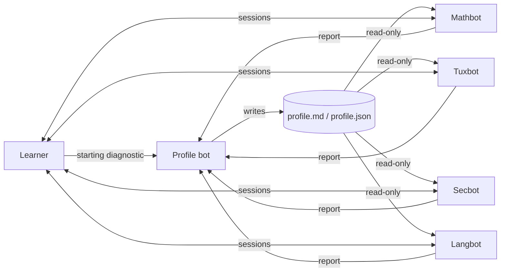

# Grok Bot Academy: a small agentic tutoring loop

Grok Bot Academy is a prototype of AI-agent tutoring. A **Profile bot** measures your level in
each subject, and **teacher bots** teach you. After every session, each teacher sends a report
to the Profile bot, which updates the profile. Teachers read that profile to adapt the next session.

It is a prototype, not a finished product. Try it, break it, improve it.

## The loop

1. **First interaction**: the Profile bot asks questions, one subject at a time, and assigns a starting level.
2. **Session**: the teacher reads the profile, then runs a goal, a short explanation, exercises, a correction and a takeaway.
3. **Verification by exercise**: every session ends with an unaided exercise. Its result validates the learning or not. Never validate on an explanation alone.
4. **Report**: the teacher sends the Profile bot a short summary (topics covered, exercise and result, decision validated / to review, recurring mistakes, difficulties, estimated level, next step).
5. **Update**: the Profile bot confirms level changes and rewrites the profile. Only it writes to the profile.

## Repository contents

- `ARCHITECTURE.md`: roles, rules and design choices.
- `prompts/`: generic prompts for the 5 bots (Profile, Mathbot, Tuxbot, Secbot, Langbot).
- `shared/profil.example.json` and `shared/profil.example.md`: shared profile format.
- `CONTRIBUTING.md`: how to propose an improvement.

## Set it up yourself

The concept is platform-independent: you only need several LLM agents that share a folder and can message each other.

1. Create 5 agents, one per file in `prompts/`, using the prompt as instructions.
2. Set up a shared folder readable by all (for example `academy/`), with a copy of the files in `shared/`.
3. Give only the Profile bot write access to `profil.md` and `profil.json`.
4. Let teachers message the Profile bot (inter-agent messaging, a queue, a webhook, or simply a `reports/` folder it reads).
5. Start with the Profile bot's diagnostic, then run a session with a teacher.

## Key design choices

- **Single writer** for the profile, to avoid contradictions.
- **Verification by exercise**: a level only goes up after a successful unaided exercise.
- **No invention**: a level or result exists only if it comes from a real answer or report.
- **Free models first**: the concept is designed to run on free quotas.
- **Defensive security**: the cybersecurity teacher teaches offensive practice only on legal environments (labs, CTFs, test machines). Never scan or attack third-party systems.
- **Sandbox** for command exercises (Linux), never on the learner's own machine.

## Ideas for improvement

- Finer level scale and sub-skills per domain.
- Spaced repetition: the Profile bot schedules reviews.
- New teachers (code, finance, sciences): the loop is the same.
- Automatic quality evaluation of corrections.
- A light web interface on top of the shared profile.

## License

MIT. See `LICENSE`.
